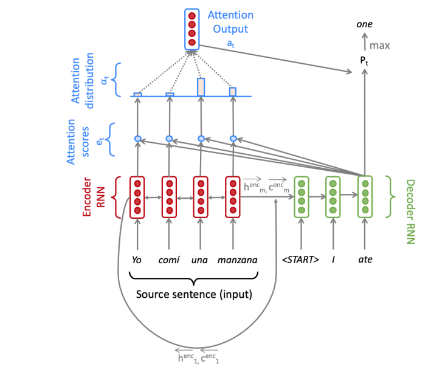

# NEURAL MACHINE TRANSLATION
This repo is a pytorch implementation of Stanford CS224N Neural Machine Transalation Assignment (Spanish to English)

## Model Architecture

## Sample predictions

### Example 1:
Source sentence:
<code>
Mientras navegamos hacia un futuro incierto, necesitamos todas las formas de inteligencia humana en el planeta para hacer frente a los desafos que enfrentamos como sociedad.</code> 

Ground truth:
<code>As we sail into an uncertain future,  we need every form of human intelligence on the planet  working together to tackle the challenges that we face as a society.</code> 

Prediction:
<code>as we are navigating to an uncertain future we need all the forms of human intelligence on the planet to address the challenges that we face as a society</code>

### Example 2:

Source sentence:
<code>
Durante la mayor parte del siglo XX, los mdicos contaron una historia sobre qu es el autismo y cmo se descubri, pero esa historia result ser falsa, y las consecuencias de la misma estn teniendo un impacto devastador en la salud pblica mundial.</code>

Ground truth:
<code>For most of the 20th century,  clinicians told one story  about what autism is and how it was discovered,  but that story turned out to be wrong,  and the consequences of it  are having a devastating impact on global public health.</code>

Prediction:
<code>for most of the 20th century the doctors told a story about what autism and how it was discovered but that story turned out to be false and the consequences of the same are having a devastating impact on global health health</code>

We can find more examples from these files 
Source sentences file <code>en_es_data/test.es</code> 
Ground truth sentences file <code>en_es_data/test.en</code> 
Predicted sentences file <code> predictions.txt</code> 

### Directions to train/test model:
Train:<code>sh run.sh train</code> 
Test:<code>sh run.sh test</code> 
To download trained model here is the link : https://drive.google.com/open?id=12vgIIjJzaML4I7lysrkju-hV0UEafsNb
